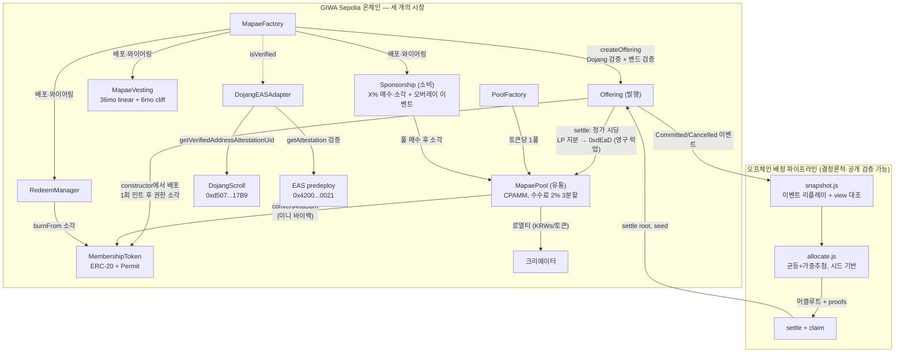

# GIWA Sepolia 배포 (GASOK 1기 제출)

체인: GIWA Sepolia (chain ID `91342`) · Explorer: https://sepolia-explorer.giwa.io

> **상태: 최종 배포 완료 (M5, 2026-07-23 배포 · 2026-07-25 데모 완결), 전 컨트랙트 verified ✅.**
> 배포자: `0x67a29AE83f3320C5E9b81D8a1531dE8FcCBED00C` · 심사위원 워크스루: [`docs/SUBMISSION.md`](SUBMISSION.md)

## 컨트랙트 주소 (전부 verified ✅)

### 코어

| 컨트랙트 | 주소 |
|---|---|
| MockKRW (KRWs) | [`0x44FAb686723C7672CF7cA9018baf502AFfE55d04`](https://sepolia-explorer.giwa.io/address/0x44FAb686723C7672CF7cA9018baf502AFfE55d04) |
| MockDojang (selfVerify 원클릭 체험) | [`0x850Eb31fd5418e902B8DB1e7f126b12032F787aB`](https://sepolia-explorer.giwa.io/address/0x850Eb31fd5418e902B8DB1e7f126b12032F787aB) |
| PoolFactory | [`0x392C0Dbb43d3f118D10f80F7FE33E5aeba41F7f6`](https://sepolia-explorer.giwa.io/address/0x392C0Dbb43d3f118D10f80F7FE33E5aeba41F7f6) |
| **MapaeFactory (메인 데모)** | [`0xb5b8f10fE64A785279329e1Ab1fE4AE67F3975A7`](https://sepolia-explorer.giwa.io/address/0xb5b8f10fE64A785279329e1Ab1fE4AE67F3975A7) |
| **DojangEASAdapter (실 Dojang 연동)** | [`0x69903dD3b32B5EC3BB8DE8D167053ec80e4b3566`](https://sepolia-explorer.giwa.io/address/0x69903dD3b32B5EC3BB8DE8D167053ec80e4b3566) |
| MapaeFactory (GIWA-Native 쇼케이스) | [`0xC4d23C7349FA1496f39380A32Cce98D850dB60dA`](https://sepolia-explorer.giwa.io/address/0xC4d23C7349FA1496f39380A32Cce98D850dB60dA) |

### Offering A 스택 (모드 A — 초과 응모·추첨·상장·리딤·후원)

| 컨트랙트 | 주소 |
|---|---|
| Offering A | [`0xdE5c071C58553A9fd8662eDdD51A30bAFCfabaec`](https://sepolia-explorer.giwa.io/address/0xdE5c071C58553A9fd8662eDdD51A30bAFCfabaec) |
| MembershipToken A (MAPA) | [`0xF18409dE4939996c996E9Ae454bE55cCfcc617F5`](https://sepolia-explorer.giwa.io/address/0xF18409dE4939996c996E9Ae454bE55cCfcc617F5) |
| **MapaePool A (정가 상장, LP→0xdEaD)** | [`0x23CAB150FA6Ca1503aA1FA10B1C7FE3b88db7CB6`](https://sepolia-explorer.giwa.io/address/0x23CAB150FA6Ca1503aA1FA10B1C7FE3b88db7CB6) |
| RedeemManager A | [`0x49B5006115eA7864281c9Cc8fEa829292A204Bb4`](https://sepolia-explorer.giwa.io/address/0x49B5006115eA7864281c9Cc8fEa829292A204Bb4) |
| MapaeVesting A (36mo/6mo) | [`0x4E0528b1C72073d55583332915f75A7cf2F7422f`](https://sepolia-explorer.giwa.io/address/0x4E0528b1C72073d55583332915f75A7cf2F7422f) |
| Sponsorship A | [`0x23b23Af6170E37D205F4D7C1d5f1E09cBE92226F`](https://sepolia-explorer.giwa.io/address/0x23b23Af6170E37D205F4D7C1d5f1E09cBE92226F) |

### Offering B 스택 (모드 B — 미달·미판매분 소각)

| 컨트랙트 | 주소 |
|---|---|
| Offering B | [`0x1e5050B8f6e6A5203dab37902b051B421D76b32c`](https://sepolia-explorer.giwa.io/address/0x1e5050B8f6e6A5203dab37902b051B421D76b32c) |
| MembershipToken B (MAPB) | [`0x4BC92cfea5Fb24d529eC4Ba154aCA9d34E56805D`](https://sepolia-explorer.giwa.io/address/0x4BC92cfea5Fb24d529eC4Ba154aCA9d34E56805D) |
| MapaePool B | [`0x765d258bBBBD184749712133617A1320F180a360`](https://sepolia-explorer.giwa.io/address/0x765d258bBBBD184749712133617A1320F180a360) |
| RedeemManager B | [`0x67A784c871BbB6f8291D2F44fA3E77d4e7b67513`](https://sepolia-explorer.giwa.io/address/0x67A784c871BbB6f8291D2F44fA3E77d4e7b67513) |
| MapaeVesting B | [`0xCEa52ab0553581b2343D10CCCb3E28F6Dba1E143`](https://sepolia-explorer.giwa.io/address/0xCEa52ab0553581b2343D10CCCb3E28F6Dba1E143) |
| Sponsorship B | [`0xaCa3FD0072f16CDe3EFD0191c3c2f1eBc5a20901`](https://sepolia-explorer.giwa.io/address/0xaCa3FD0072f16CDe3EFD0191c3c2f1eBc5a20901) |

## 데모 히스토리 (Stage 1~3 완결 ✅)

**발행**: [createOffering A](https://sepolia-explorer.giwa.io/tx/0xb610613d61a975b77c0b65e24d16003f5c1d5cd2d89970418293373eb1c5ffad) ·
[createOffering B](https://sepolia-explorer.giwa.io/tx/0xbad491e6611e3b87ab5eb992f7c595fecfc946e7fbbf165fe23330f5dd1dd7ab) —
A: 5.1M/5M 초과 응모 ([부분 취소](https://sepolia-explorer.giwa.io/tx/0x5f93de281330b29054438e9ef5b849b8c47db161c4c263183f9d297d59ffb07f) 포함) · B: 3M/5M (60%)

**정산+상장** (원자 실행, 시드 = 마감 후 첫 블록 `31488807` 해시):
- [settle A](https://sepolia-explorer.giwa.io/tx/0xb3f3921a854547741b1053e5f0603e339dd09446a3ecdfac230ae3fa1fbc7abb) — 500 토큰 배정(균등+가중추첨), 풀 정가 시딩(스팟 == P = 10,000 KRWs), LP 지분 0xdEaD 민트, 루트 `0x746c...c36a`
- [settle B](https://sepolia-explorer.giwa.io/tx/0x0f14b9234708021ad0d4427ea705dc8dfaa1a64cac14cedd27252be28be9091f) — **UnsoldBurned 200 토큰** (`Transfer → 0x0`) 후 300 판매분만 발행·상장, 루트 `0x4d98...d725`

**소비**: [createRedeemable](https://sepolia-explorer.giwa.io/tx/0x6bc8f296f9ba9f2c12a47330c8d14a94595f2adce666717c48007ea99e1f8162) →
리딤 소각 2건 ([1](https://sepolia-explorer.giwa.io/tx/0x85f176ee0d093bb86558d6fa541067c93e6ab3d8f45afffdee045dbdb216166f),
[2](https://sepolia-explorer.giwa.io/tx/0x1d940bc5682b1252ba06c5ed7e349089b15838cec03309dbd636a7306cd24d76))

**유통+플라이휠 (Stage 3)**:
[매수 20k KRWs → 1.910 토큰](https://sepolia-explorer.giwa.io/tx/0xc0b19bfa4bfe534f6fe988c9aabe340598d3dc265239d379c3240ef96547156c) ·
[매도 1 토큰 (0.5% 즉시 소각)](https://sepolia-explorer.giwa.io/tx/0xd497d2a294f9c559a2a62ee6a3d3b46fdf768c5d8d7c7d79b265c1d034a23015) ·
[후원 10k KRWs (10% 매수·소각 + 메시지)](https://sepolia-explorer.giwa.io/tx/0xd9e31a26f798542bc21d6b6684101b97eb09b2f6e494ab07d98ac4f92dc5a745) ·
[convertAndBurn (미니 바이백)](https://sepolia-explorer.giwa.io/tx/0xd0d0b339290ad6a64d3b8019ec7462ca511400fbd84d3c07bcc8c007534f4a00)

## 이원 구성 (심사위원용)

- **메인 데모 스택** — `MapaeFactory(MockDojang)`: 데모 시나리오 전체가 여기서 실행된다.
  검증 플래그를 우리가 통제하므로 시연이 항상 재현 가능하다.
- **GIWA-Native 쇼케이스** — `DojangEASAdapter` + `MapaeFactory(어댑터)`: 어댑터는 **실제
  GIWA Sepolia의 DojangScroll(`0xd507...17B9`, 라이브 ABI 검증 완료)과 EAS predeploy
  (`0x4200...0021`)를 조회**한다. 실 Verified Address(업비트 KYC 증명) 지갑은 코드 변경
  없이 이 팩토리에서 공모를 개설할 수 있다 — Dojang 어테스테이션이 곧 크리에이터 온보딩.

## 데모 시나리오가 증명하는 것

| | Offering A (모드 A) | Offering B (모드 B) |
|---|---|---|
| 시나리오 | **초과 응모** — 6개 지갑이 R=5백만 KRWs 대비 5.1M 응모 (부분 취소 1건 포함) | **미달** — 3개 지갑이 목표의 60%만 응모 |
| 증명 1 | 균등+가중추첨 배정: 오프체인 결정론 계산 → 머클루트 커밋 → 시드 공개 (제3자 재계산 검증 가능) | 실판매분만 발행: S' = 판매량/f 재산정 |
| 증명 2 | 지갑당 한도 L·실명 검증(Dojang)·발행자 자기응모 차단 | **UnsoldBurned** — 미판매 40% 즉시 소각 (`Transfer → 0x0`이 explorer에 영구 증빙: "더 희소하게 태어난다") |
| 증명 3 | 클레임 풀 방식 + 환불 dust 팬 귀속 | 리딤(소각형 소비) — 회원권의 실사용 경로 |

## 아키텍처

## 아카이브 — 1차 배포 (M3, 2026-07-22)

최종 재배포 후에도 심사위원이 1차 배포·데모 기록을 확인할 수 있도록 원본 JSON을
`deployments/archive-m3/`에 보존한다. 1차 배포의 주소·데모 tx는 이 문서의 히스토리
(git) 및 위 "데모 히스토리" 섹션 원본에서 확인 가능하다.

## 재현 (제3자 검증)

1. `Settled` 이벤트에서 `allocationRoot`·`totalSold`·`totalRaised`·`seed` 확인
2. `node script/allocation/snapshot.js --rpc https://sepolia-rpc.giwa.io --offering <주소> --out snap.json`
3. `node script/allocation/allocate.js --snapshot snap.json --seed <이벤트 seed>`
4. 출력 루트가 온체인 값과 일치하면 배정이 조작되지 않았음이 증명된다
   (조작되었어도 온체인 회계 상한이 초과 인출을 차단 — `docs/TRUST.md`)
