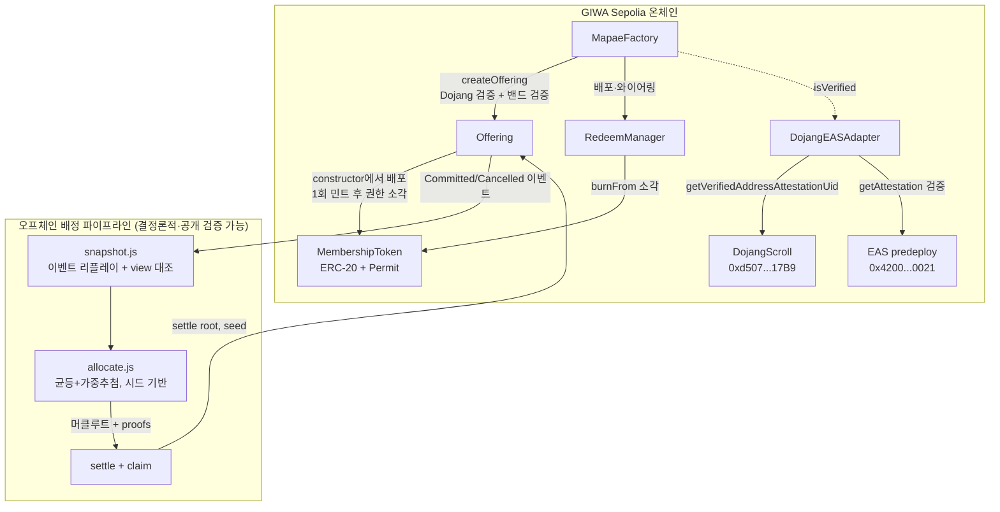

# GIWA Sepolia 배포 (GASOK 1기 제출)

체인: GIWA Sepolia (chain ID `91342`) · Explorer: https://sepolia-explorer.giwa.io

> **상태: 배포 완료 (2026-07-22), 전 컨트랙트 verified ✅.**
> 배포자: `0x67a29AE83f3320C5E9b81D8a1531dE8FcCBED00C` · 데모 Stage 1 완료,
> **Stage 2 실행 가능 시각: 2026-07-22 20:11:24 UTC (= 2026-07-23 05:11:24 KST) 이후**

## 컨트랙트 주소 (전부 verified ✅)

| 컨트랙트 | 주소 |
|---|---|
| MockKRW (KRWs) | [`0xD76E01E39dc5414028Fc800B28De72A6ef6233C9`](https://sepolia-explorer.giwa.io/address/0xD76E01E39dc5414028Fc800B28De72A6ef6233C9) |
| MockDojang | [`0x3b7f6eff2933dEd3a7e6334b0c6D06c0fE37fBAc`](https://sepolia-explorer.giwa.io/address/0x3b7f6eff2933dEd3a7e6334b0c6D06c0fE37fBAc) |
| **MapaeFactory (메인 데모)** | [`0x41329c0D53Bcebf72C499AF0b0dDCDb11cE40F1F`](https://sepolia-explorer.giwa.io/address/0x41329c0D53Bcebf72C499AF0b0dDCDb11cE40F1F) |
| **DojangEASAdapter (실 Dojang 연동)** | [`0xbdbd941432Ec4cf3e8762007C4F1948308756410`](https://sepolia-explorer.giwa.io/address/0xbdbd941432Ec4cf3e8762007C4F1948308756410) |
| MapaeFactory (GIWA-Native 쇼케이스) | [`0xd651615E4d7146E9A2d606A0bBCe65EE41f264BB`](https://sepolia-explorer.giwa.io/address/0xd651615E4d7146E9A2d606A0bBCe65EE41f264BB) |
| Offering A (모드 A, 초과 응모) | [`0x5cfa0C147ea1A2B7DF7811Df0653164b81257bAA`](https://sepolia-explorer.giwa.io/address/0x5cfa0C147ea1A2B7DF7811Df0653164b81257bAA) |
| MembershipToken A (MAPA) | [`0x7F00952e1e397C6b5eF00123BceCf7020cd2f69B`](https://sepolia-explorer.giwa.io/address/0x7F00952e1e397C6b5eF00123BceCf7020cd2f69B) |
| RedeemManager A | [`0x6d14006864793f4F16EC6E177c0C89eB7500A9D5`](https://sepolia-explorer.giwa.io/address/0x6d14006864793f4F16EC6E177c0C89eB7500A9D5) |
| Offering B (모드 B, 미달→소각) | [`0xc13f54b25d030053F4f146516B7283AC427217d0`](https://sepolia-explorer.giwa.io/address/0xc13f54b25d030053F4f146516B7283AC427217d0) |
| MembershipToken B (MAPB) | [`0xDd7315Fbcdfd682E505A326CfE14D123e6860A9b`](https://sepolia-explorer.giwa.io/address/0xDd7315Fbcdfd682E505A326CfE14D123e6860A9b) |
| RedeemManager B | [`0xBb7d10E8C8576cBd639B245aF2A72B0d5cbE812A`](https://sepolia-explorer.giwa.io/address/0xBb7d10E8C8576cBd639B245aF2A72B0d5cbE812A) |

데모 현황 (Stage 1 완료): Offering A **5.1M / 5M KRWs 초과 응모** (부분 취소 1건 포함) ·
Offering B **3M / 5M (60%)** — 마감: 2026-07-22 20:11:24 UTC.

## 이원 구성 (심사위원용)

- **메인 데모 스택** — `MapaeFactory(MockDojang)`: 데모 시나리오 전체가 여기서 실행된다.
  검증 플래그를 우리가 통제하므로 시연이 항상 재현 가능하다.
- **GIWA-Native 쇼케이스** — `DojangEASAdapter` + `MapaeFactory(어댑터)`: 어댑터는 **실제
  GIWA Sepolia의 DojangScroll(`0xd507...17B9`, 라이브 ABI 검증 완료)과 EAS predeploy
  (`0x4200...0021`)를 조회**한다. 실 Verified Address(업비트 KYC 증명) 지갑은 코드 변경
  없이 이 팩토리에서 공모를 개설할 수 있다 — Dojang 어테스테이션이 곧 크리에이터 온보딩.

## 데모 시나리오가 증명하는 것

| | Offering A (모드 A) | Offering B (모드 B) |
|---|---|---|
| 시나리오 | **초과 응모** — 6개 지갑이 R=5백만 KRWs 대비 5.1M 응모 (부분 취소 1건 포함) | **미달** — 3개 지갑이 목표의 60%만 응모 |
| 증명 1 | 균등+가중추첨 배정: 오프체인 결정론 계산 → 머클루트 커밋 → 시드 공개 (제3자 재계산 검증 가능) | 실판매분만 발행: S' = 판매량/f 재산정 |
| 증명 2 | 지갑당 한도 L·실명 검증(Dojang)·발행자 자기응모 차단 | **UnsoldBurned** — 미판매 40% 즉시 소각 (`Transfer → 0x0`이 explorer에 영구 증빙: "더 희소하게 태어난다") |
| 증명 3 | 클레임 풀 방식 + 환불 dust 팬 귀속 | 리딤(소각형 소비) — 회원권의 실사용 경로 |

## 아키텍처

## 재현 (제3자 검증)

1. `Settled` 이벤트에서 `allocationRoot`·`totalSold`·`totalRaised`·`seed` 확인
2. `node script/allocation/snapshot.js --rpc https://sepolia-rpc.giwa.io --offering <주소> --out snap.json`
3. `node script/allocation/allocate.js --snapshot snap.json --seed <이벤트 seed>`
4. 출력 루트가 온체인 값과 일치하면 배정이 조작되지 않았음이 증명된다
   (조작되었어도 온체인 회계 상한이 초과 인출을 차단 — `docs/TRUST.md`)
